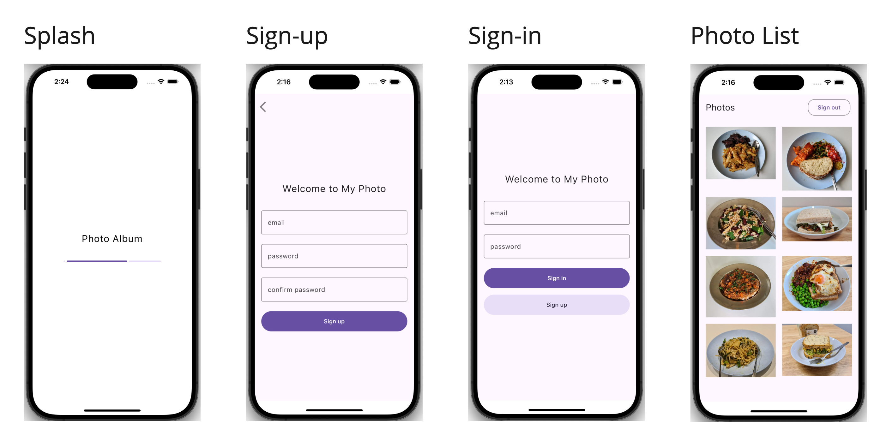

# KMP Project

> ⚠️ **Project Setup Instructions Outdated**  
> Instructions provided in the file "How To Set Up and Run the KMP Project.pdf" is outdated. Fleet IDE is no longer supported.

A template to jumpstart a KMP/CMP project with modularization, clean architecture, MVVM and UDF.

This project uses:
- Ktor for networking
- Kotlin Coroutines for asynchronous tasks
- Jetpack Navigation for screen transitions
- Jetpack DataStore for local persistence
- Firebase for app distributions

## UI Design
This is not a full-fledged photo album. It’s just a simple photo viewer to help you jumpstart setting up your own project.

## Get the Precompiled App
- [iOS](https://aungthiha.github.io/iOSAppAccessAutomation/pages/firebase-setup.html) - Automatically compiled and distributed after email registration (usually within 20 minutes)
- Android - Please, manually compile from the source (for now)

## Roadmap
- Update setup instruction because Fleet IDE is no longer supported 
- Write integration tests to ensure new changes don't break the existing ones
- Write instrumentation tests to ensure things work as expected on real devices
- Use paging3 in PhotoListScreen to support pagination
- Figure out which snapshot test framework would be best suited for the project
- Set up snapshot tests
- Research the benefits of `com.android.kotlin.multiplatform.library` over `com.android.library`
- Implement [Talaiot](https://github.com/cdsap/Talaiot) to analyze Gradle tasks
- Implement AES-GCM encryption for session storage to enhance security
- Implement remote Gradle cache
- Unify the jvmToolchain version across all modules to make updating java versions easy
- Use [Spotless](https://github.com/diffplug/spotless) to sort the keys in version catalog to make searching keys easier

## CI/CD
- [iOS](https://github.com/AungThiha/iOSAppAccessAutomation)
- Android (Pending)

## Contributing
PRs and feedback welcome!

## License
Apache 2.0